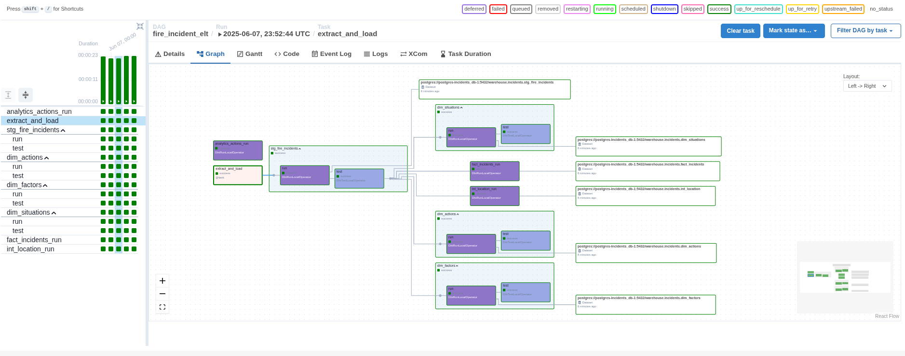

# Fire Data

## Initial Profiling

- according to the website publishing/data change frequency is daily
- Rows 706K
- Columns 66
- Each row is an Incident
- Row Identifier ID
- Endpoint Version: 2.1

## Tools chosen

### Helper library

- > SODA 2.0 API endpoints have a max limit of 50,000 records while SODA 2.1 endpoints have no upper limit.
- Since this dataset has Endpoint 2.1, we may request the whole dataset in a single query, this has pros and cons
- The [API documentation](https://dev.socrata.com/foundry/data.sfgov.org/wr8u-xric), under Code Snippets, suggests to interact with the API via Python using [sodapy](https://github.com/afeld/sodapy)
- The library serves as an interface to the API and blends well with Pandas
- [the get_all method](https://github.com/afeld/sodapy/tree/main?tab=readme-ov-file#get_alldataset_identifier-content_typejson-kwargs) can paginate the dataset
- [reading the code](https://github.com/afeld/sodapy/blob/52e14224361dd083a37a0267676d8d9e0c581228/sodapy/socrata.py#L402-L420) shows that the generator makes queries only when the limit is exhausted, instead of overloading the network

### Database

- Postgres has good support and features for dealing with all sorts of data
- native JSON datatype support

## Populating the database

- even though `df.to_sql` is able to insert without previous table creation, sometimes pandas doesn't guess the datatype correctly
    - we can use the `/docker-entrypoint-initdb.d/` volume to create the schema upfront
    - this will also help with the conflict resolution by specifying a primary key

- the table has a `point` column with GeoJSON datatype
    - this insertion fails without any handling while using pandas' `df.to_sql`
    - using a GeoJSON type would be good but postgres does not have native support
    - we could use postgis docker image but since Geo data is not the focus, it's best to just use it as JSON

### DBT

- good developer experience
- easy to chain multiple queries, tests, constraints

## Running


```bash

# for this test you may use as airflow .env:
_AIRFLOW_WWW_USER_USERNAME="airflow"
_AIRFLOW_WWW_USER_PASSWORD="airflow"
AIRFLOW_CONN_INCIDENTS='{
    "conn_type": "postgres",
    "login": "postgres",
    "password": "postgres",
    "schema": "warehouse",
    "host": "postgres-incidents_db-1",
    "port": 5432,
	"extra": {"options": "-c search_path=raw"}
}'

# and postgres:
POSTGRES_DB=warehouse
POSTGRES_USER=postgres
POSTGRES_PASSWORD=postgres

# start the postgres container first, due to the shared_network creation
cd postgres
docker compose up -d
# start airflow
cd ../airflow
docker compose up -d --build
```

- Airflow should should be accessible in localhost:8080
- run the dbt DAG, the first run should take a while to get all the data, but subsequent should be faster due to CDC
- after pulling the data, dbt project will run automatically
- cosmos library provides a nice UI of the DBT project
- DBT is also configured with incremental updates


