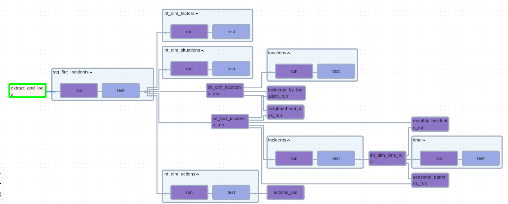
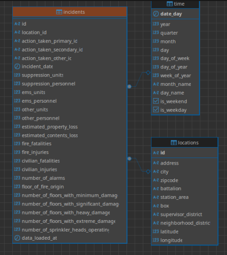
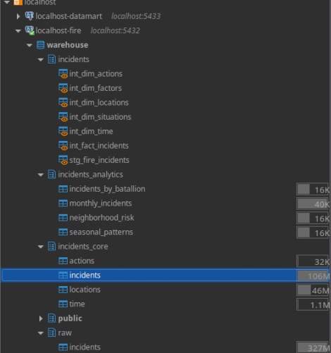

# San Francisco Fire Incidents Data Pipeline

A modern data engineering pipeline analyzing San Francisco Fire Department
incident data using the medallion architecture pattern. This project implements
a complete ELT (Extract, Load, Transform) workflow with CDC, automated
orchestration, dimensional modeling, and data quality testing.

## Project Structure

```
├── airflow/                    # Orchestration layer
│   ├── dags/dbt/incidents/     # dbt project with dimensional models
│   ├── dbt_dag.py              # Main pipeline DAG
│   └── docker-compose.yaml     # Airflow deployment
├── postgres/                   # Data warehouse setup
│   ├── init/                   # Database schema initialization
│   └── docker-compose.yaml     # Postgres deployment
└── docker-compose.yaml         # Full stack deployment
```

### Airflow/Cosmos UI



### Schema





For detailed component documentation:

- **[Airflow](./airflow/README.md)**
- **[Postgres](./postgres/README.md)**
- **[dbt](./airflow/dags/dbt/README.md)**


## Architecture Overview

This pipeline follows modern data engineering best practices with a **medallion
architecture** built on:

- **Data Source**: [SF Fire Incidents API](https://data.sfgov.org/Public-Safety/Fire-Incidents/wr8u-xric/about_data) (~706K records, 66 columns)
- **Orchestration**: Apache Airflow with Astronomer Cosmos for dbt integration
- **Data Warehouse**: PostgreSQL with dimensional star schema
- **Transformation**: dbt with layered models (staging → intermediate → marts)
- **Infrastructure**: Fully containerized with Docker Compose

```
SF Fire API → Airflow (Extract/Load) → PostgreSQL (Bronze) → dbt (Transform) → Analytics Models (Gold)
```

## Features

- **Incremental Processing**: Daily CDC-based updates with conflict resolution
- **Dimensional Modeling**: Star schema with time, location, action, and factor dimensions
- **Data Quality**: Comprehensive dbt tests for data validation and constraints
- **Observability**: Full pipeline visibility through Airflow UI with dbt lineage
- **Reproducibility**: One-command deployment with Docker Compose
- **Production-Ready**: Error handling, retries, and transaction safety

## Insights

This pipeline provides marts to answer questions:

- **Resource Allocation**: Which battalions handle the most incidents?

```SQL
SELECT
    battalion,
    incident_count,
    avg_personnel_per_incident,
    casualty_rate_percent
FROM incidents_analytics.incidents_by_batallion
ORDER BY incident_count DESC
LIMIT 10;
```

|battalion|incident_count|avg_personnel_per_incident|casualty_rate_percent|
|---------|--------------|--------------------------|---------------------|
|B02|108702|9.5|0.10|
|B03|104237|9.7|0.11|
|B01|86561|10.2|0.07|
|B04|75624|9.8|0.10|
|B10|63806|8.8|0.22|
|B08|59425|9.0|0.11|
|B09|56832|8.9|0.20|
|B05|54194|9.6|0.16|
|B06|53059|9.4|0.21|
|B07|40873|9.5|0.13|


- **Seasonal peaks**

```SQL
SELECT
    quarter,
    month_name,
    incident_count,
    avg_units_required,
    total_loss::text::money
FROM incidents_analytics.seasonal_patterns
ORDER BY incident_count DESC
LIMIT 10;
```

|quarter|month_name|incident_count|avg_units_required|total_loss|
|-------|----------|--------------|------------------|----------|
|1|January  |47029|2.6|$60,329,536.00|
|4|December |44531|2.8|$84,795,909.00|
|4|October  |43790|2.8|$71,478,570.00|
|1|March    |42785|2.8|$99,796,462.00|
|3|July     |42302|2.7|$167,742,636.00|
|3|August   |41696|2.7|$103,048,481.35|
|4|November |41660|2.7|$46,070,682.60|
|2|May      |41389|2.7|$55,032,895.00|
|3|September|41138|2.8|$44,225,047.99|
|2|April    |40409|2.7|$64,910,592.00|

- **High-risk neighborhoods**:

```SQL
SELECT
    neighborhood_district,
    incident_count,
    casualty_rate_percent,
    avg_loss_per_incident,
    incident_rank
FROM incidents_analytics.neighborhood_risk
WHERE incident_rank <= 10
ORDER BY casualty_rate_percent DESC;
```

|neighborhood_district|incident_count|casualty_rate_percent|avg_loss_per_incident|incident_rank|
|---------------------|--------------|---------------------|---------------------|-------------|
|Bayview Hunters Point|39650|0.29|3082.21|5|
|Mission|62859|0.22|3319.12|2|
|Tenderloin|65355|0.15|3786.01|1|
|Sunset/Parkside|26584|0.15|1894.12|7|
|Nob Hill|24323|0.14|1495.01|8|
|Western Addition|28875|0.11|1074.24|6|
|Hayes Valley|18537|0.08|2175.02|10|
|South of Market|53224|0.06|935.00|4|
|Pacific Heights|19438|0.05|1139.33|9|
|Financial District/South Beach|54280|0.04|613.54|3|

- **Incident severity**:

```SQL
SELECT
    month_name,
    incident_count,
    fatal_incidents,
    total_personnel_deployed,
    CONCAT(ROUND((fatal_incidents::NUMERIC / incident_count * 100), 2), '%')  as fatality_rate_percent
FROM incidents_analytics.monthly_incidents
ORDER BY fatality_rate_percent DESC
LIMIT 10;
```

|month_name|incident_count|fatal_incidents|total_personnel_deployed|fatality_rate_percent|
|----------|--------------|---------------|------------------------|---------------------|
|February |3059|2|27528|0.07%|
|September|2214|1|21293|0.05%|
|May      |2177|1|21135|0.05%|
|April    |1921|1|18113|0.05%|
|February |2158|1|20526|0.05%|
|June     |2204|1|23534|0.05%|
|June     |2162|1|20440|0.05%|
|April    |2157|1|20156|0.05%|
|January  |2821|1|24492|0.04%|
|November |2244|1|21033|0.04%|

## Quick Start


```bash
git clone https://github.com/leoperegrino/fire_incidents
cd fire-incidents-pipeline

# Airflow configuration
cat <<EOF > ./airflow/.env
_AIRFLOW_WWW_USER_USERNAME="airflow"
_AIRFLOW_WWW_USER_PASSWORD="airflow"
AIRFLOW_CONN_INCIDENTS='{
   "conn_type": "postgres",
   "login": "postgres",
   "password": "postgres",
   "schema": "warehouse",
   "host": "incidents-incidents_db-1",
   "port": 5432,
   "extra": {"options": "-c search_path=raw"}
}'
EOF

# PostgreSQL configuration
cat <<EOF > ./postgres/.env
POSTGRES_DB=warehouse
POSTGRES_USER=postgres
POSTGRES_PASSWORD=postgres
EOF

docker compose up -d --build
```

**Run Pipeline**

- **Airflow UI**: http://localhost:8080 (airflow/airflow)
- Trigger the `dbt_dag` in Airflow UI
- First run extracts all historical data (~10-15 minutes)
- Subsequent runs process only new/updated records


